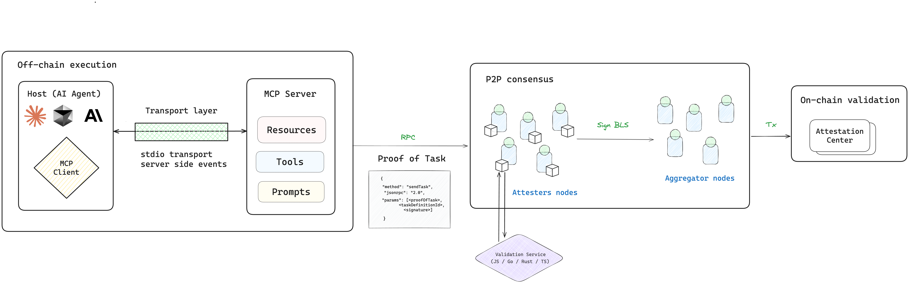

# AVS MCP Server

## Table of Contents

1. [Overview](#overview)
2. [Components](#components)
3. [Installation](#installation)
4. [Usage](#usage)
5. [Next Steps](#next-steps)
6. [Disclaimer](#disclaimer)
## Overview

The AVS MCP server acts as an interface between the AI Agents and the AVS network, enabling you to execute any AVS [Tasks](https://docs.othentic.xyz/main/learn/core-concepts/tasks/task-definitions) with on chain validation.



### Key Features

- **Decentralized Verification:** Submit tasks to the AVS network for consensus-based verification

- **Verifiable Outputs:** Generate cryptographic proofs of AI-initiated tasks

- **On chain Validation:** Execute transaction on chain

- **Blockchain Data Access:** Query real-time blockchain data for informed AI decision-making


## Components
[MCP Server](https://modelcontextprotocol.io/quickstart/server) requires the development of custom tools. You can create tools for generating [Proof of Task](https://docs.othentic.xyz/main/learn/core-concepts/tasks/proof-of-task) and sending it to the AVS network. Additionally, you can integrate external resources such as APIs, databases, and local storage.

The following MCP server includes functionality to fetch the `ETHUSDT` price and call the `sendTask` RPC method to trigger the AVS Task.

### Tools  

- **get-price**: Fetches the price of a cryptocurrency pair using the Binance API.  
  - **Input:**  
    - `pair` (string): The name of the cryptocurrency pair (e.g., `ETHUSDT`).  

- **send-task**  
  - **Input:**  
    - `price` (string): Price of the pair.  
    - `data` (string): Any additional data.  

## Installation

1. Clone the repository:

   ```bash
   git clone https://github.com/Othentic-Labs/avs-mcp-example.git
   cd avs-mcp-example
   ```

2. Install Othentic CLI:

   ```bash
  npm i -g @othentic/cli
  npm i -g @othentic/node
   ```


## Usage
1. **Ensure the AVS Network is running**

Make sure your AVS network is up and running before proceeding. Refer to the [Quickstart Guide](https://docs.othentic.xyz/main/welcome/getting-started/install-othentic-cli) for instructions on running an AVS network.

2. **Build the MCP server**

Run the following commands to compile the server:

```bash
cd MCP_Execution_Server
npm i
npm run build
```

3. **Configure Claude Desktop**
   
Add the configuration for the MCP Server in your `claude_desktop_config.json` file. Detailed instructions are available in the Claude Desktop [Configuration Guide](https://modelcontextprotocol.io/quickstart/user).

Replace `ADD_ABSOLUTE_PATH` and `YOUR_PERFORMER_PRIVATE_KEY_HERE` with the appropriate values:

```JSON
{
  "mcpServers": {
    "AVSPerformer": {
      "command": "node",
      "args":["ADD_ABSOLUTE_PATH/avs-mcp-example/MCP_Execution_Server/build/index.js"],
      "env": {
        "PRIVATE_KEY_PERFORMER": "YOUR_PERFORMER_PRIVATE_KEY_HERE",
        "PERFORMER_ADDRESS": "YOUR_PERFORMER_ADDRESS_HERE",
        "OTHENTIC_CLIENT_RPC_ADDRESS":"http://localhost:8545",
        "PINATA_API_KEY": "7824585a98fe36414d68",
        "PINATA_SECRET_API_KEY": "41a53a837879721969e73008d91180df30dbc66097c7f75f08cd5489176b43ea",
      }
    }
  }
}
```

4. **Sample Prompts**
   
You can interact with the AVS MCP Server using prompts such as:

```bash
can you get the price of ETHUSDT?
can you validate this price using AVS network?
```

5. **Verify the On-Chain Transaction**

Check the on-chain transaction in the Attestation Center contract to confirm execution within the AVS network.


## Next Steps
- Write an MCP server for your AVS
- Test it out and add it to the MCP Server repository.

### Use Cases

- **AI-Powered DeFi:** Trading agents that interface with intent solver AVS to bridge liquidity

- **Autonomous Agents:** Make decisions based on real-time indexed blockchain data

- **Workflow Automation:** Trigger and monitor on-chain actions across integrated applications

- **Oracle Integration:** Access verifiable data through oracle AVS networks

Happy Building! 🚀

## Disclaimer

This repository is an experimental implementation intended for testing and development purposes only. Do not use this in production environments without conducting a thorough security audit.

